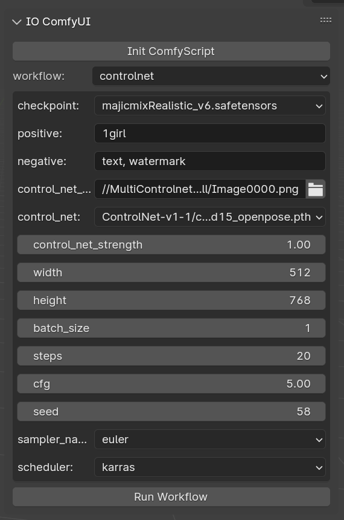

# io_comfyui

Let Blender work with ComfyUI by ComfyScript.  
This addon is still in development.

# Installation

## ComfyUI

You'll need an [ComfyUI](https://github.com/comfyanonymous/ComfyUI) installation, which can be local or remote.  
This addon currently requires ComfyUI to have the following nodes installed:

- [comfyui-tooling-nodes](https://github.com/Acly/comfyui-tooling-nodes)

## Blender

Install like other blender addon.  
Download [main.zip](https://github.com/gameltb/io_comfyui/archive/refs/heads/main.zip).  
It requires the installation of dependencies in the [requirements.txt](requirements.txt). I'm not sure what to do in the environment you're using.

# Usage

## Basic usage

You need to start comfyui first.  
Than set comfyui server address in addon preferences.  
Find `IO ComfyUI` panel at 3D view, Usually click the N key to toggle Show/Hide.  
Click the `Init ComfyScript` and select workflow.

## Make your own workflow

This addon base on [ComfyScript](https://github.com/Chaoses-Ib/ComfyScript), You can refer to it documentation to make your own workflow.  
example

- [controlnet](custom_workflows/controlnet.py)
- [simple_t2i](custom_workflows/simple_t2i.py)

New workflow can be save to custom_workflows/ like example.
